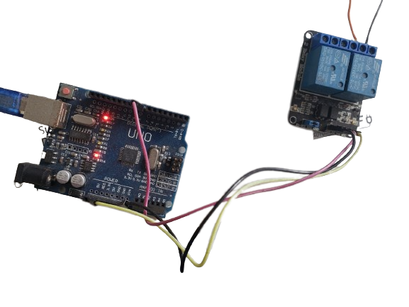

# Plant Waterer with Arduino

This project is a simple water trigger controller for plants.

This uses an Arduino Uno and a Relay Module.

The Control Pin used was 8. The other connections are for power.



## Troubleshooting

If the IDE does not recognize your board, try this steps:

Workaround: disable brltty

```
sudo systemctl stop brltty-udev.service
sudo systemctl mask brltty-udev.service
sudo systemctl stop brltty.service
sudo systemctl disable brltty.service
```

## References

https://bugs.launchpad.net/ubuntu/+source/brltty/+bug/1990189
